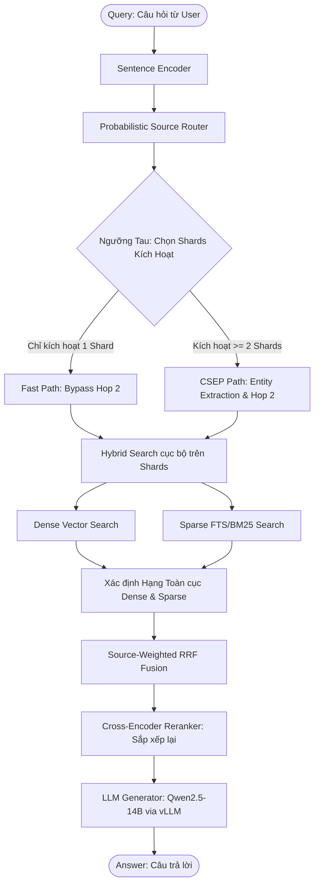

# Kiến Trúc Hiện Tại Của T-RAG (T-RAG Current Architecture)

T-RAG (Selective Table RAG) là một pipeline RAG tối ưu cho dữ liệu doanh nghiệp (Enterprise Data), được thiết kế để giải quyết bài toán tìm kiếm trên không gian dữ liệu phân tán (Multi-table/Multi-shard) với hai tiêu chí cốt lõi: **Siêu tốc (Low Latency)** và **Độ chính xác cao (High Accuracy)**.

Dưới đây là mô tả chi tiết các thành phần trong kiến trúc hiện tại của T-RAG sau khi tích hợp **Hybrid Search** và **Source-Weighted Reciprocal Rank Fusion (SW-RRF)** thực thụ.

---

## 1. Sơ Đồ Kiến Trúc Luồng Dữ Liệu (Data Flow)

---

## 2. Chi Tiết Các Thành Phần Cốt Lõi

### 2.1. Bộ Định Tuyến Nguồn Xác Suất (Probabilistic Source Router - PSR)
* **Chức năng:** Thay vì quét qua tất cả 9 bảng dữ liệu (Confluence, Jira, GitHub, Slack, v.v.), PSR phân tích ngữ nghĩa câu hỏi để dự đoán xác suất câu trả lời nằm ở từng bảng dữ liệu:
  $$P(\text{Source}_i | \text{Query})$$
* **Kích hoạt Shard (Sub-space Search):** Chỉ các bảng có xác suất $P \ge \tau$ (ngưỡng Tau, ví dụ `0.15`) mới được đưa vào danh sách quét (`active_shards`). Điều này giúp cắt giảm không gian tìm kiếm lên tới 80% đối với các truy vấn đơn giản.

### 2.2. Cơ Chế Bỏ Qua CSEP Thông Minh (Smart CSEP Bypassing)
* **CSEP (Conditional Search Space Expansion):** CSEP thực hiện trích xuất thực thể (Entity Extraction) bằng LLM và chạy tìm kiếm vòng 2 (Hop 2) để mở rộng ngữ cảnh (ví dụ: tìm file code liên quan đến ticket Jira).
* **Tối ưu hóa Bypassing:** Nếu PSR chỉ định tuyến câu hỏi đến **1 bảng duy nhất** (ví dụ: chỉ Confluence), T-RAG sẽ tự động **bỏ qua bước CSEP (Hop 2)**. Việc này loại bỏ hoàn toàn các cuộc gọi LLM không cần thiết, giúp giảm latency của khâu Retrieval xuống dưới 0.2 giây.

### 2.3. Tìm Kiếm Hỗn Hợp Cục Bộ (Local Hybrid Search)
Trên mỗi Shard được kích hoạt, T-RAG thực hiện đồng thời hai phương thức tìm kiếm:
1. **Tìm kiếm Vector (Dense Search):** Sử dụng embedding của câu hỏi để tìm kiếm khoảng cách L2 gần nhất trên index vector (LanceDB). Đại diện cho độ tương đồng ngữ nghĩa.
2. **Tìm kiếm Toàn văn (Sparse Search / BM25):** Thực hiện Full-Text Search (FTS) trên trường `content` thông qua Tantivy index. Đại diện cho độ khớp từ khóa chính xác (mã lỗi, email, ID dự án).

### 2.4. Dung Hợp Xếp Hạng Trọng Số Nguồn (Source-Weighted Reciprocal Rank Fusion - SW-RRF)
Sau khi thu thập các ứng viên Dense và Sparse từ tất cả Shards hoạt động, T-RAG thực hiện xếp hạng và dung hợp toàn cục:
* **Xác định hạng toàn cục (Global Ranking):**
  * Sắp xếp các ứng viên Dense theo khoảng cách vector để tìm hạng Dense toàn cục ($Rank_{Dense}$).
  * Sắp xếp các ứng viên Sparse theo điểm FTS/BM25 để tìm hạng Sparse toàn cục ($Rank_{Sparse}$).
* **Dung hợp và Nhân trọng số (Fusion & Prior Weighting):**
  Điểm số SW-RRF cho mỗi tài liệu được tính bằng công thức:
  $$\text{Score}_{\text{SW-RRF}} = P(\text{Source} | \text{Query})^\gamma \times \left( \frac{1}{k_{\text{RRF}} + Rank_{Dense}} + \frac{1}{k_{\text{RRF}} + Rank_{Sparse}} \right)$$
  Trong đó:
  * $k_{\text{RRF}}$ (mặc định `60`): Hằng số ổn định thứ hạng.
  * $\gamma$ (mặc định `2.0`): Hệ số Bayesian Prior để ưu tiên các tài liệu từ Shards có xác suất Router cao hơn.

### 2.5. Tái Sắp Xếp (Reranking) & Sinh Đáp Án (Generation)
* **Cross-Encoder Reranker:** Sử dụng model `ms-marco-MiniLM-L-6-v2` để chấm điểm lại Top 20 tài liệu sau bước Fusion. Thiết lập `RERANKER_THRESHOLD=-100.0` để Reranker chỉ thực hiện nhiệm vụ sắp xếp lại thứ tự (Re-ordering) mà không lọc bỏ tài liệu (nhường quyền từ chối trả lời cho LLM).
* **LLM Generator:** Qwen2.5-14B-Instruct được phục vụ thông qua vLLM engine, nhận ngữ cảnh gồm Top 5 tài liệu tốt nhất để tổng hợp câu trả lời chính xác nhất.
