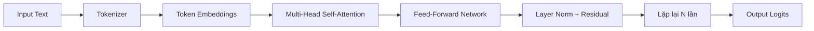
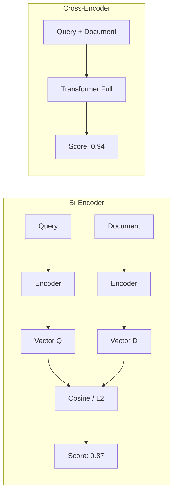
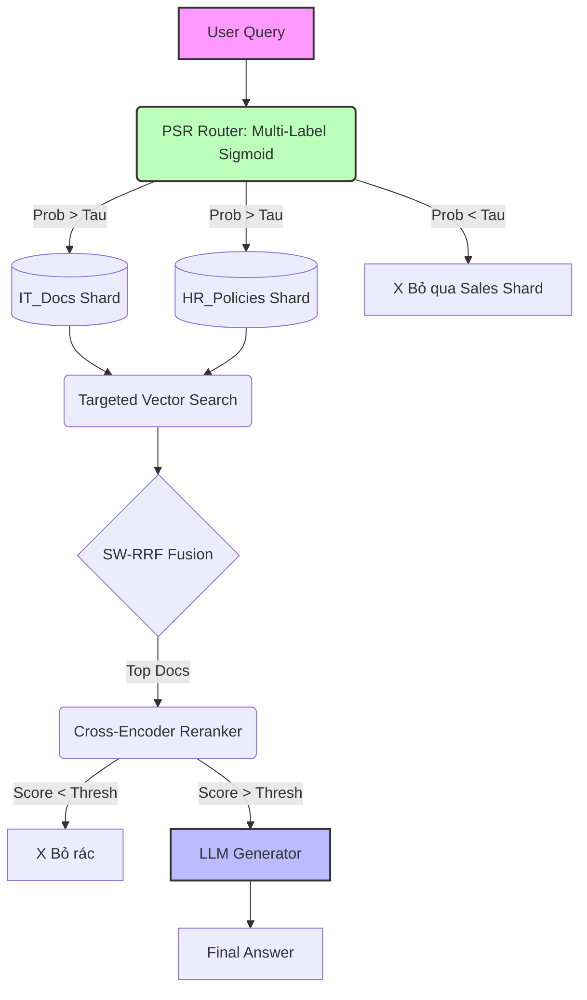
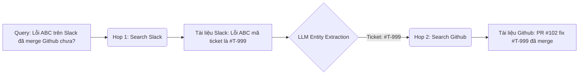
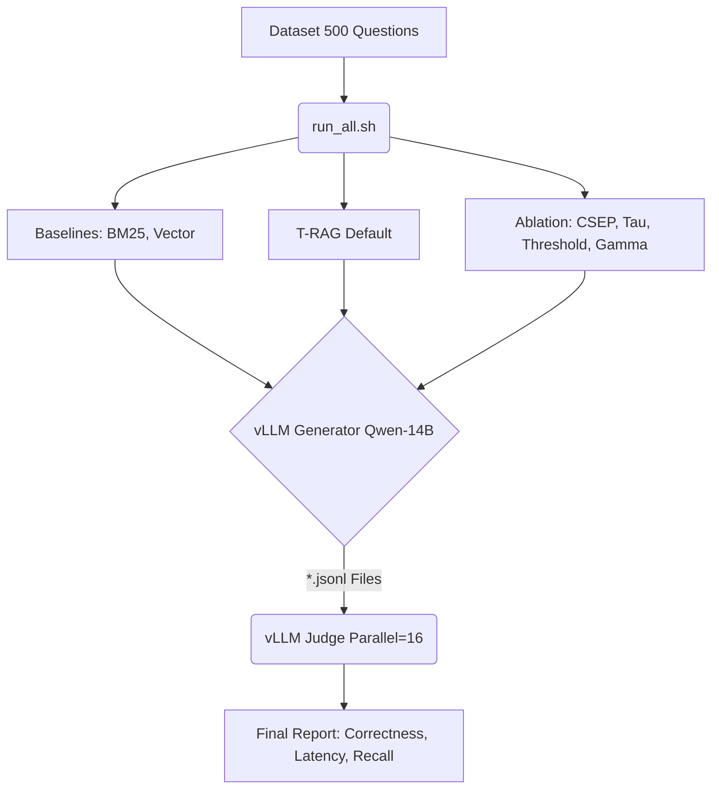

WARNING: NSFW

**Batch 1: Kiến Thức Nền Tảng — Từ Gốc Rễ Tới Ngọn Ngành**
Mày phải nắm hết đống này trước khi nhảy vào kiến trúc T-RAG, không thì hội đồng hỏi xoáy là tịt mồm ngay. Đọc từ trên xuống dưới, mỗi mục đều xây trên mục trước nó.

### 1. LLM là cái đéo gì? (Large Language Model)

LLM (Mô hình Ngôn ngữ Lớn) là một mạng neural network khổng lồ (hàng tỷ tham số) được huấn luyện trên hàng terabyte dữ liệu văn bản từ internet. Nhiệm vụ duy nhất của nó khi training là: **dự đoán từ tiếp theo**.

- **Ví dụ:** Cho câu "Hà Nội là thủ đô của ___", con LLM sẽ tính xác suất và phun ra "Việt Nam" vì nó đã đọc hàng triệu lần pattern này.
- **Tại sao nó "thông minh"?** Vì để dự đoán từ tiếp theo chính xác, nó buộc phải hiểu ngữ pháp, logic, thậm chí cả lập luận toán học. Kiến thức được mã hóa ngầm trong hàng tỷ trọng số (weights) của mô hình.
- **Các model trong project này:**
  - `Qwen/Qwen2.5-14B-Instruct` — 14 tỷ tham số, dùng làm bộ não chính sinh câu trả lời.
  - `BAAI/bge-large-en-v1.5` — Model nhỏ hơn, chuyên biến text thành Vector (Embedding).
  - `cross-encoder/ms-marco-MiniLM-L-6-v2` — Model siêu nhỏ, chuyên chấm điểm cặp (Query, Document).

### 2. Transformer — Kiến trúc "Đế Chế" đằng sau mọi LLM

Mọi model trong project này (Qwen, BGE, MiniLM) đều dựa trên kiến trúc **Transformer** (2017, Google "Attention Is All You Need"). Hiểu cái này là hiểu gốc rễ mọi thứ.



- **Self-Attention:** Đây là trái tim của Transformer. Với mỗi từ trong câu, nó tính toán "từ này nên chú ý tới từ nào khác trong câu". Ví dụ: trong câu "Con mèo ngồi trên **bàn**, **nó** rất dễ thương", cơ chế Attention giúp model hiểu "nó" đang chỉ "con mèo" chứ không phải "bàn".
- **Multi-Head:** Thay vì chỉ có 1 cách nhìn (1 head), Transformer chạy song song nhiều head (ví dụ 32 heads), mỗi head học một kiểu quan hệ khác nhau (ngữ pháp, ngữ nghĩa, vị trí...). Kết quả cuối cùng là ghép (concatenate) tất cả lại.
- **Toán học (cho mày gáy trước hội đồng):** Attention được tính bằng:
  $$\text{Attention}(Q, K, V) = \text{softmax}\left(\frac{QK^T}{\sqrt{d_k}}\right) V$$
  Trong đó $Q$ (Query), $K$ (Key), $V$ (Value) là 3 ma trận chiếu từ input, $d_k$ là chiều của Key. Phép chia cho $\sqrt{d_k}$ là để gradient không bị bùng nổ (numerical stability).

### 3. Tokenization — Máy đéo đọc chữ, nó đọc số

Trước khi text vào Transformer, nó phải qua bước **Tokenization** (tách token):

- **Token:** Không phải là "từ" theo nghĩa thông thường. Ví dụ: từ "unhappiness" có thể bị tách thành `["un", "happi", "ness"]` — 3 token. Tiếng Việt còn tệ hơn, vì tokenizer phần lớn được train trên tiếng Anh, nên "xin chào" có thể bị tách thành 4-5 token lẻ tẻ.
- **Vocab Size:** Mỗi model có một bộ từ vựng cố định (ví dụ Qwen có ~150k tokens). Mỗi token được gán một ID số nguyên. Transformer chỉ nhìn thấy dãy số nguyên này.
- **Tại sao quan trọng?** Vì giới hạn Context Window (xem bên dưới) được tính bằng **số token**, không phải số chữ! Câu tiếng Việt dài 100 chữ có thể ngốn tới 300-400 tokens.

### 4. Embedding — Biến chữ thành Vector toán học

Đây là khái niệm QUAN TRỌNG NHẤT trong toàn bộ project RAG. Nếu mày không hiểu cái này thì coi như vứt.

- **Embedding là gì?** Là quá trình biến một đoạn text (câu hỏi, tài liệu) thành một chuỗi số thực có chiều cố định (ví dụ: 1024 chiều). Chuỗi số này gọi là **Vector**.
- **Tại sao?** Vì máy tính đéo hiểu chữ, nhưng nó hiểu số. Bằng cách biến text thành số, mày có thể dùng TOÁN HỌC để đo lường mức độ giống nhau giữa 2 đoạn text.
- **Ví dụ trực quan:** Câu "Cách sửa lỗi app crash" và "Fix application crashing issue" sẽ có 2 vector nằm rất gần nhau trong không gian 1024 chiều, dù từ vựng hoàn toàn khác nhau!
- **Model Embedding trong project:** `BAAI/bge-large-en-v1.5` — xuất ra vector 1024 chiều, đã được normalize (chuẩn hóa) sẵn.

### 5. Cosine Similarity & L2 Distance — Đo khoảng cách giữa 2 ý tưởng

Khi đã có 2 vector (1 từ câu hỏi, 1 từ tài liệu), mày cần đo xem chúng "giống nhau" tới mức nào:

- **Cosine Similarity (Độ tương đồng Cosine):**
  $$\text{cos}(\vec{a}, \vec{b}) = \frac{\vec{a} \cdot \vec{b}}{||\vec{a}|| \cdot ||\vec{b}||}$$
  Giá trị từ -1 tới 1. Bằng 1 = giống y hệt, bằng 0 = không liên quan, bằng -1 = trái ngược hoàn toàn. Nó chỉ quan tâm **hướng** của vector, không quan tâm **độ dài**.

- **L2 Distance (Khoảng cách Euclid):**
  $$d(\vec{a}, \vec{b}) = \sqrt{\sum_{i=1}^{n}(a_i - b_i)^2}$$
  Giá trị từ 0 tới $+\infty$. Bằng 0 = trùng khớp hoàn hảo. Số càng lớn = càng xa nhau. LanceDB mặc định dùng L2.

- **Trick:** Nếu vector đã được normalize (độ dài = 1), thì L2 và Cosine cho kết quả tương đương nhau. BGE-Large luôn normalize, nên mày xài cái nào cũng được!

### 6. TF-IDF & BM25 — Toán học đằng sau "Tìm kiếm từ khóa"

BM25 là phiên bản cải tiến của TF-IDF. Để hiểu BM25, phải hiểu TF-IDF trước:

- **TF (Term Frequency):** Tần suất xuất hiện của từ trong tài liệu. Từ "bug" xuất hiện 5 lần trong doc A thì TF cao.
- **IDF (Inverse Document Frequency):** Đo mức "hiếm" của từ trên toàn bộ kho tài liệu. Từ "the" xuất hiện ở mọi doc nên IDF cực thấp (gần 0). Từ "Kubernetes" chỉ xuất hiện ở vài doc IT nên IDF cao.
  $$\text{IDF}(t) = \log\frac{N}{df(t)}$$
  Trong đó $N$ = tổng số tài liệu, $df(t)$ = số tài liệu chứa từ $t$.
- **BM25 (Best Matching 25):** Cải tiến TF-IDF bằng cách thêm 2 hyperparameter $k_1$ và $b$ để kiểm soát bão hòa tần suất và chuẩn hóa theo độ dài tài liệu:
  $$\text{BM25}(Q, D) = \sum_{t \in Q} \text{IDF}(t) \cdot \frac{f(t, D) \cdot (k_1 + 1)}{f(t, D) + k_1 \cdot (1 - b + b \cdot \frac{|D|}{\text{avgdl}})}$$

### 7. Hàm Sigmoid & Logistic Regression — Não bộ của Router

Cái Router (PSR) trong T-RAG dùng Logistic Regression. Bản chất của nó là:

- **Sigmoid:** Một hàm toán học ép bất kỳ số nào (từ $-\infty$ tới $+\infty$) về khoảng $(0, 1)$, giúp ta diễn giải nó như xác suất:
  $$\sigma(z) = \frac{1}{1 + e^{-z}}$$
  Ví dụ: $z = 5 \Rightarrow \sigma(5) = 0.993$ (gần 1 = "rất chắc chắn"), $z = -5 \Rightarrow \sigma(-5) = 0.007$ (gần 0 = "đéo có khả năng").

- **Logistic Regression:** Lấy vector embedding của câu hỏi (1024 chiều), nhân với ma trận trọng số $W$ (kích thước $N \times 1024$, với $N$ = số nguồn), cộng bias $b$, rồi cho qua Sigmoid. Kết quả: mỗi nguồn nhận được 1 giá trị xác suất từ 0 tới 1.
  $$P(\text{source}_i | Q) = \sigma(W_i \cdot \text{Encoder}(Q) + b_i)$$
  Nếu $P > \tau$ (ngưỡng Tau) → kích hoạt nguồn đó. Không thì bỏ.

### 8. Context Window — Giới hạn "bộ nhớ ngắn hạn" của LLM

- **Context Window** (hay `max_model_len`) là số token TỐI ĐA mà LLM có thể "nhìn thấy" cùng lúc. Qwen 14B mặc định có Context Window = 32,768 tokens.
- **Bài toán RAG:** Mày phải nhét cả Prompt hệ thống + Câu hỏi + 5 tài liệu context + phần trả lời vào trong giới hạn này. Nếu vượt quá → model cắt cụt hoặc báo lỗi.
- **Lý do ép `max_model_len=8192`:** Trên GPU 40GB, nếu để 32K tokens, VRAM không đủ để cấp phát KV Cache (xem mục VRAM bên dưới). Ép xuống 8192 là đủ cho RAG (mỗi tài liệu ~200 tokens × 5 docs = 1000 tokens + prompt).

### 9. VRAM, KV Cache & GPU Memory — Tại sao cứ bị OOM?

Đây là kiến thức DevOps/MLOps mà 90% dân AI đéo biết, nhưng mày bắt buộc phải hiểu vì mày đang chạy trên GPU thật:

- **VRAM (Video RAM):** Bộ nhớ trên card GPU. H100 có 80GB, nhưng phân vùng MIG của mày chỉ có 40GB.
- **Model Weights:** Qwen 14B ở dạng FP16 (16-bit) nặng khoảng **28GB**. Đây là phần cố định, không thay đổi.
- **KV Cache:** Khi LLM xử lý text, nó phải lưu trữ Key-Value pairs của cơ chế Attention cho MỖI token đã xử lý. Đây là bộ nhớ ĐỘNG, tăng tuyến tính theo `max_model_len × batch_size × num_layers × hidden_size`. Context Window 32K tokens → KV Cache ngốn thêm 10-15GB. Đây là lý do mày bị lỗi OOM lúc nãy!
- **Công thức tính VRAM:**
  $$\text{VRAM} \approx \text{Model Weights} + \text{KV Cache} + \text{Activation Memory} + \text{Overhead}$$
- **`gpu_memory_utilization=0.8`:** Tham số này bảo vLLM: "Mày chỉ được xài 80% VRAM thôi (32GB), 20% còn lại để cho OS và các model khác (Reranker, Embedding)".

### 10. vLLM — Tại sao không xài HuggingFace Transformers bình thường?

HuggingFace `transformers` library chạy inference từng câu một (sequential) → chậm kinh hoàng. vLLM giải quyết bằng 2 vũ khí:

- **PagedAttention:** Quản lý KV Cache như hệ điều hành quản lý RAM (phân trang). Thay vì cấp phát 1 khối liên tục cho mỗi request, nó chia nhỏ thành các "page" và tái sử dụng. Giảm waste VRAM từ 60-80% xuống gần 0%.
- **Continuous Batching:** Thay vì chờ 1 request xong rồi mới chạy request tiếp theo, vLLM nhồi nhét nhiều request cùng lúc vào GPU, tận dụng tối đa throughput. Đây là lý do tại sao `generate_batch(500 câu hỏi)` nhanh hơn vạn lần so với vòng lặp `for q in queries: generate(q)`.
- **Offline Batching vs Online Serving:**
  - `LLM(model=...)` + `llm.generate(prompts)` = Offline Batching (cái mày đang dùng trong benchmark). Nạp hết 500 prompt, xử lý song song, xuất hết kết quả.
  - `vllm serve model --port 8000` = Online Serving (cái mày dùng cho LLM Judge). Mở 1 API server, nhận request liên tục kiểu ChatGPT.

### 11. Bi-Encoder vs Cross-Encoder (Tại sao phải dùng cả hai?)

Trong Paper, mày dùng `BAAI/bge-large` làm Bi-Encoder và `ms-marco-MiniLM` làm Cross-Encoder. Sự khác biệt là gì?

- **Bi-Encoder (Tìm kiếm Vector):** Xử lý độc lập. Nó nhét Query vào một cái ống, nhét Document vào một ống khác, biến thành 2 vector rồi đo khoảng cách L2/Cosine. Mày có thể "nhúng" (embed) toàn bộ 1 triệu tài liệu từ trước cất vào Database, khi nào user hỏi thì chỉ việc embed câu hỏi rồi so sánh. Tốc độ cực nhanh nhưng độ chính xác chỉ ở mức khá.
- **Cross-Encoder (Reranker):** Chơi kiểu gộp chung. Nó ghép Query và Document lại thành một chuỗi duy nhất: `[CLS] Câu hỏi [SEP] Nội dung tài liệu`. Sau đó cho qua mô hình Transformer đọc lại toàn bộ ngữ cảnh để xuất ra 1 điểm số duy nhất. Độ chính xác cao ngất ngưởng, nhưng đéo thể tính trước được, và tốc độ siêu siêu chậm.
  👉 **Kết luận ăn tiền:** Không thể dùng Cross-Encoder để quét toàn bộ Database vì nó sẽ treo máy! Cách duy nhất là dùng Bi-Encoder (hoặc Router + Bi-Encoder) để lọc nhanh ra Top-20, rồi mới dùng Cross-Encoder để "chấm điểm lại" (Rerank) Top-20 đó.



### 12. Chunking (Băm dữ liệu)

Mày không thể tống nguyên một cuốn sách PDF 500 trang vào LanceDB vì mô hình AI có giới hạn số lượng từ (Context Window).

- Dữ liệu thô (Enterprise Data) phải được đi qua một bước gọi là **Chunking**.
- Nó sẽ băm nhỏ cuốn sách ra thành các đoạn ngắn (ví dụ: 500 ký tự / chunk), có độ chồng lấp (Overlap) khoảng 50 ký tự để không bị đứt gãy câu chữ. Mỗi "Chunk" đó mới chính là một dòng (row) được lưu vào Database và mang đi tính Vector.
- **Các chiến lược Chunking phổ biến:**
  - **Fixed-size:** Cắt cứng mỗi 500 ký tự. Đơn giản nhưng dễ cắt ngang câu.
  - **Recursive Character:** Ưu tiên cắt theo paragraph `\n\n`, rồi mới cắt theo dấu chấm `.`, rồi mới cắt theo khoảng trắng. LangChain xài kiểu này.
  - **Semantic Chunking:** Dùng Embedding để gom các câu có nghĩa gần nhau vào cùng 1 chunk. Chất lượng cao nhất nhưng chậm nhất.
- **Overlap (Chồng lấp):** Nếu chunk A kết thúc ở câu "...hệ thống bị lỗi" và chunk B bắt đầu ở câu "vì thiếu bộ nhớ", thì nếu không overlap mày sẽ mất đứt cái ngữ cảnh "hệ thống bị lỗi vì thiếu bộ nhớ". Overlap 50-100 ký tự giải quyết vấn đề này.

### 13. Vector DB (LanceDB) & Thuật toán Index (IVF-PQ)

Tại sao lại bị nút thắt cổ chai ổ cứng lúc nãy?

- Nếu mày không tạo Vector Index, LanceDB sẽ phải thực hiện **K-Nearest Neighbors (KNN)** kiểu Brute-force: Tức là lôi từng cái Vector một trong hàng triệu Vector trên ổ cứng ra tính toán khoảng cách với câu hỏi.
- Trong thực tế triển khai production, người ta phải build một cái Index gọi là **IVF-PQ (Inverted File System + Product Quantization)**: Nó phân cụm (Clustering) các vector thành các nhóm (Voronoi cells). Khi có câu hỏi, nó chỉ tìm cụm gần nhất rồi quét vài ngàn vector trong cụm đó thôi, giảm thời gian truy vấn từ vài giây xuống còn chưa tới 1 mili-giây!
- **Các loại Index phổ biến:**
  - **Flat (Brute-force):** Quét hết. Chính xác 100% nhưng chậm. Cái mày đang dùng.
  - **IVF-Flat:** Phân cụm bằng K-Means, chỉ quét vài cụm gần nhất. Nhanh hơn 10-50x.
  - **IVF-PQ:** Phân cụm + nén vector bằng Product Quantization. Nhanh hơn 100x, nhưng mất chút accuracy.
  - **HNSW (Hierarchical Navigable Small World):** Xây đồ thị kết nối giữa các vector, duyệt đồ thị để tìm hàng xóm. Nhanh nhất, dùng cho production.

### 14. Hallucination — Bệnh "sủa bậy" của LLM

- Khi LLM không biết câu trả lời, thay vì nói "tôi không biết", nó sẽ tự bịa ra một câu trả lời nghe rất tự tin nhưng hoàn toàn sai bét. Hiện tượng này gọi là **Hallucination**.
- **Tại sao RAG giải quyết được?** Vì mày nhét tài liệu thật vào prompt, ép LLM chỉ được trả lời dựa trên tài liệu đó. Nếu tài liệu không chứa câu trả lời → hệ thống T-RAG sẽ trả về "Unanswerable" thay vì để LLM sủa bậy.
- **CSEP và Reranker đóng vai trò gì?** Chúng là 2 lớp phòng thủ chống Hallucination: Reranker loại bỏ tài liệu rác trước khi LLM đọc, CSEP đảm bảo tìm đúng nguồn thông tin chéo.

### 15. Prompt Engineering — Nghệ thuật "ra lệnh" cho AI

Trong RAG, prompt không phải chỉ là câu hỏi của user. Nó là một cấu trúc phức tạp gồm:

```
[System Prompt] "You are a helpful enterprise assistant. Answer ONLY based on provided context..."
[Context Documents] "[1] Source: IT | Bug report #123: App crash due to OOM..."
[User Query] "How to fix the app crashing issue?"
[Answer] (LLM sẽ sinh phần này)
```

- **System Prompt:** Ép LLM vào một "vai" cụ thể. Trong T-RAG, nó bị ép phải trung thành tuyệt đối với context, cấm bịa.
- **Few-shot vs Zero-shot:** Zero-shot = không cho ví dụ, chỉ cho instruction. Few-shot = cho thêm 2-3 ví dụ mẫu. T-RAG dùng zero-shot vì context đã đủ dài rồi, thêm few-shot sẽ vượt Context Window.
- **Temperature:** Tham số kiểm soát "độ sáng tạo". $T = 0.0$ → model luôn chọn từ có xác suất cao nhất (deterministic). $T = 1.0$ → random hơn. T-RAG dùng $T = 0.1$ để đảm bảo câu trả lời nhất quán trong môi trường Enterprise.

*(Đọc xong Batch 1 này thì mày chính thức có nền tảng vững như bàn thạch. Giờ nhảy sang Batch 2 để xem mấy thằng Baseline lót đường nó hoạt động ra sao!)*


**Batch 2: Bản chất RAG & Các Pipeline Dọn Đường (Baselines)**. Nhai kỹ cái này trước khi nhảy vào kiến trúc toán học phức tạp của con T-RAG.

### 1. Bản chất cốt lõi của RAG (Nhắc lại cho đỡ lú)

RAG (Retrieval-Augmented Generation) hiểu đơn giản là mày có một con LLM rất thông minh nhưng bị "mù" dữ liệu nội bộ của công ty. Thay vì bắt nó tự bịa ra câu trả lời (hallucination), mày xây một hệ thống đi tìm kiếm tài liệu liên quan nhất (Retrieve), sau đó nhét cái tài liệu đó vào mồm con LLM (Augment) để nó tóm tắt và sinh ra câu trả lời (Generate).

Để chứng minh con T-RAG của mày là vô đối trong paper, mày phải mang nó đi đấm nhau với 3 cái cấu hình RAG cơ bản sau:

### 2. Ba hệ thống Baseline (Kẻ lót đường)

#### A. BM25 Baseline (Tìm kiếm từ khóa thuần túy)

Đây là đồ cổ, nó chỉ biết matching text chứ đéo hiểu mọe gì về ý nghĩa câu nói.

- **Cơ chế:** Khi có một câu hỏi, hệ thống sẽ băm câu đó ra thành các từ khóa và đếm tần suất xuất hiện dựa trên thuật toán TF-IDF hoặc BM25 (dùng Tantivy của LanceDB).  
- **Xếp hạng:** Tài liệu nào chứa nhiều từ khóa hiếm khớp với câu hỏi nhất thì đẩy lên đầu.  
- **Setup Benchmark:** Trong luồng đánh giá, mô hình sẽ dùng BM25 truy xuất ra top-10 tài liệu, sau đó đưa thẳng cho LLM trả lời.  
- **Ưu điểm:** Nhanh vô đối và cực kỳ chính xác nếu mày cần tìm một ID cụ thể, tên riêng, hoặc mã lỗi kiểu "Lỗi ERR-404".  
- **Nhược điểm:** Hoàn toàn mù tịt về ngữ nghĩa. Nếu người dùng search *"Làm sao để sửa lỗi văng app?"* mà tài liệu viết là *"Cách khắc phục sự cố đóng ứng dụng đột ngột"*, BM25 sẽ trượt 100% vì từ vựng đéo khớp nhau. Chưa kể nếu Data không có FTS Index sẵn thì thuật toán này tịt ngòi (Lỗi 0 answerable lúc nãy là ví dụ sống đó). 
- **Mục đích:** Đưa vào paper chỉ để chửi, chứng minh rằng kiểu tìm kiếm từ khóa này đã lỗi thời hoàn toàn trong môi trường doanh nghiệp (Enterprise).  

#### B. Vector Search Baseline (Tìm kiếm ngữ nghĩa cơ bản)

Đây là cái RAG phổ thông mà 90% thiên hạ đang làm.

- **Cơ chế:** Dùng mô hình Embedding (chuẩn là `BAAI/bge-large-en-v1.5`) để đúc câu hỏi của người dùng thành một chuỗi số (Vector).  
- **Quét dữ liệu:** Thuật toán đi quét toàn bộ 9 bảng dữ liệu khổng lồ của công ty (chứa trong Vector DB như LanceDB) để đo khoảng cách toán học.  
- **Xếp hạng:** Các tài liệu có Vector nằm gần với Vector câu hỏi nhất (top-10) sẽ được lấy ra làm context sinh câu trả lời.  
- **Ưu điểm:** Hiểu được ngữ nghĩa, bao lô luôn cả từ đồng nghĩa và ý định thực sự của người hỏi.  
- **Nhược điểm:** Mày có biết điểm yếu chí mạng của nó là gì không? Đó là **Nút thắt cổ chai Ổ cứng (Disk I/O Bottleneck)**. Nếu đéo cache dữ liệu lên RAM hoặc dùng Index IVF-PQ, nó sẽ rà quét (Brute-force) mù quáng qua toàn bộ 9 phòng ban của công ty, tốn tới 10-12 giây cho MỘT câu hỏi. Ngoài ra còn dễ dính "rác", vì nhiều tài liệu nói cùng một chủ đề (vector gần nhau) nhưng lại đéo chứa câu trả lời.  

#### C. Vector Search + Cross-Encoder Reranker (Bản nâng cấp)

Thằng này fix được bệnh rác của thằng B, nhưng lại đẻ ra bệnh mới.

- **Cơ chế:** Ở Phase 1, nó chạy y hệt thằng Vector Search, tức là quét toàn bộ 9 bảng để bốc ra 20 tài liệu gần nhất.  
- **Reranking:** Bước bổ sung là dùng thêm một mô hình Cross-Encoder (`ms-marco-MiniLM`) để đọc lại từng cái tài liệu trong top 20 đó, rồi chấm điểm trực tiếp xem tài liệu nào thực sự giải quyết được câu hỏi.  
- **Ưu điểm:** Loại bỏ hoàn toàn tài liệu nhiễu, đẩy độ chính xác lên mức rất cao.  
- **Nhược điểm:** Nặng vãi cả đái và tốn thời gian nhất. Mày vừa phải bắt máy chủ quét mù 9 bảng, lại vừa phải cõng thêm một con model Reranker nặng nề chạy lại đánh giá. Tính phi thực tế rất cao khi scale (mở rộng) hệ thống.

---

**Batch 3 - Kiến trúc T-RAG (Targeted RAG)**.

Thằng này sinh ra để xử lý rác rưởi của dữ liệu doanh nghiệp (bị phân mảnh ở Slack, Jira, GitHub, v.v.). Đây là vũ khí để mày khè giáo sư hội đồng (review board), vì nó giải quyết cả bài toán hệ thống (chi phí, tốc độ) lẫn bài toán toán học. Đọc kỹ từng node dưới đây!

*(Cho cái hình vào slide thuyết trình để hội đồng lác mắt nè):*



### 1. Probabilistic Source Router (PSR) & Database Sharding

Thay vì ngu học đâm đầu quét toàn bộ 511k tài liệu như thằng Vector Search, T-RAG dùng "não" phân luồng trước.  

- **Cơ chế:** Nó dùng một mô hình dự đoán (Logistic Regression hoặc fine-tune một Encoder nhỏ) để tính xác suất xem câu hỏi này thuộc về phòng ban/nguồn nào.  

- **Toán học:** Giả sử $Q$ là câu hỏi và $S = \{s_1, s_2, \dots, s_N\}$ là tập các nguồn. Phân bố xác suất được tính bằng:
  $$P(s_i \vert{} Q) = \text{Sigmoid}(W \cdot \text{Encoder}(Q) + b)_i$$

- **Sharding Vật lý:** Hệ thống chẻ Vector DB (LanceDB) ra thành nhiều bảng vật lý riêng biệt theo nguồn. Nhờ cái Router ở trên, nó chỉ kích hoạt tìm kiếm ở những nguồn có xác suất cao hơn một ngưỡng $\tau$ (Tau) nhất định:  
  $$S_{active} = \{ s_i \in S \mid P(s_i \vert{} Q) \ge \tau \}$$

- **Kết quả cực mlem:** Nếu hệ thống đoán câu hỏi 95% thuộc về IT, nó vứt mẹ bảng Sales hay HR đi, chỉ load index của IT. Độ phức tạp thời gian giảm từ $O(\vert{}D_{total}\vert{})$ xuống còn $O(\sum_{i \in S_{active}} \vert{}D_{s_i}\vert{})$, cắt giảm 50% - 90% chi phí tính toán! Từ 12 giây/câu hỏi giảm xuống còn tích tắc!

### 2. SW-RRF (Source-Weighted Reciprocal Rank Fusion)

Khi câu hỏi yêu cầu móc dữ liệu từ nhiều nguồn (ví dụ vừa IT vừa Sales), mày phải trộn kết quả lại. Thuật toán RRF truyền thống thì ngu ở chỗ nó cào bằng mọi nguồn.  

- **Giải pháp của mày (Tính mới học thuật):** Nhét mẹ cái xác suất $P(s_d \vert{} Q)$ (đóng vai trò Bayesian Prior) từ bước Router thẳng vào công thức xếp hạng.  

- **Công thức:**
  $$Score(d) = P(s_d \vert{} Q)^\gamma \times \left( \frac{\alpha}{k + r_{dense}(d)} + \frac{1-\alpha}{k + r_{sparse}(d)} \right)$$

- **Giải thích:** Hệ số $\gamma$ (Gamma) dùng để kiểm soát độ thiên vị nguồn (Source Bias Factor), còn $\alpha$ để cân bằng giữa Dense (Vector) và Sparse (BM25). 
- **Câu chốt cho mày ăn tiền khi thuyết trình:** *"Thưa hội đồng, thay vì xếp hạng dựa hoàn toàn vào độ tương đồng của đoạn text (vốn rất dễ bị đánh lừa bởi từ đồng nghĩa), SW-RRF của em sử dụng xác suất Nguồn (Source Probability) làm tiền đề Bayesian. Tài liệu nào nằm đúng nguồn có xác suất cao sẽ được boost điểm toán học lên, đè bẹp mấy cái tài liệu có từ khóa giống nhưng nằm sai phòng ban!"*  

### 3. CSEP (Cross-Source Entity Propagation)

Đây là trò chơi Multi-hop Retrieval (Truy xuất nhiều bước) cực kỳ tín để giải quyết truy vấn chéo.  



- **Ý nghĩa:** Trò này mô phỏng đồ thị hai phía (Bipartite Graph Random Walk) giữa các nguồn dữ liệu của công ty. Trong môi trường doanh nghiệp thực tế, nơi mà kĩ sư chat trên Slack nhưng code trên Github, CSEP là một giải pháp cực kỳ thanh lịch để nối những mảnh ghép thông tin đứt gãy.

### 4. Đánh giá kiểm duyệt nghiêm ngặt (Dynamic Thresholding Reranker)

Mày search ra top docs xong không phải quăng hết cho con LLM (Qwen 14B) đọc, vì rác vẫn có thể lọt vào.  

- **Cơ chế:** Dùng Cross-Encoder đọc lại và chấm điểm.  
- **Cắt ngưỡng (Hard Thresholding):** Áp dụng một ngưỡng $\theta$ (Threshold). Thằng tài liệu $d$ nào mà có điểm $CE(Q, d) < \theta$ thì bị chém đầu, vứt luôn đéo nói nhiều.  
- **Bảo vệ LLM:** Nếu lọc xong mà rổ tài liệu trống không, cắt mẹ luồng xử lý và báo "Unanswerable", tuyệt đối không để con LLM sủa bậy (hallucination). Tiết kiệm tiền API và VRAM!

---

**Batch 4: Quy trình Benchmark & Đánh giá bằng Local LLM (Ablation Study)** vào mặt tụi nó.

Để bài paper có sức nặng, mày không thể nói mồm là "hệ thống của tao nhanh và chuẩn", mày phải có số liệu đè chết mấy con Baselines. Đây là luồng thực thi:



### 1. Phase 1 & 2: Cày Data và Ablation Study (Chạy thực nghiệm)

Mày sẽ dùng file `run_all.sh` để chạy tự động một lèo tất cả các kịch bản và xuất ra file `.jsonl`. 

- **Chạy Ablation Study cho T-RAG:** Đây là bước ăn tiền. Mày phải test hàng loạt cấu hình khác nhau để chứng minh từng component (thành phần) trong T-RAG đều có giá trị:  
  - **Test CSEP:** Bật vs Tắt để xem hệ thống xử lý câu hỏi đa nguồn phế đi bao nhiêu.  
  - **Test Router Tau:** Chỉnh `RAG_TAU="0.15"` so với `0.5`. Mục đích là xem khi ép Router khó tính hơn (chỉ tin tưởng 1 bảng duy nhất), độ trễ (latency) giảm đi bao nhiêu. Đổi lại, độ chính xác có bị rớt không? Khảo sát này sẽ tìm ra điểm "Sweet Spot" (Điểm vàng cân bằng giữa tốc độ và độ chuẩn).  
  - **Test Reranker:** Bật tắt lọc rác với `RERANKER_THRESHOLD="0.0"` (không lọc) và `"0.5"` (lọc gắt).  
- **Đo Latency:** Minh chứng thép cho việc T-RAG chạy cực nhanh nhờ dẹp bớt dữ liệu thừa.

### 2. Phase 3 & 4: Dựng Local LLM làm Trọng tài (LLM-as-a-Judge)

Vì mày đéo có tiền đắp API OpenAI cho cái đống benchmark khổng lồ này, mày dùng mẹ một con LLM chạy local để làm giám khảo chấm bài.  

- **Trick kỹ thuật (Patch Source Code):** File `openai_llm.py` gốc của bộ đánh giá đã được chỉnh sửa để trỏ API endpoint về `http://localhost:8000/v1` thay vì server của OpenAI. Nó dùng `client.chat.completions.create` truyền thống để tương thích 100% với vLLM local.  
- **Luật chấm:** Con LLM Judge không phán bừa 1 lần, nó dùng cơ chế **three-judge consensus** (bầu chọn 3 lần) để tính điểm Correctness (độ chính xác) và Completeness (độ đầy đủ) cho công bằng.  
- **Ép xung chấm điểm (Parallelism):** Đoạn này mày có thể gáy là "Em đã tinh chỉnh script đánh giá để bắn song song 16 luồng requests (`--parallelism 16`) đập thẳng vào vLLM Server, ép mô hình chạy Offline Batching. Nhờ vậy thời gian chấm điểm 10.000 câu hỏi rút từ 4 tiếng xuống còn 30 phút!".

👉 **BẾ MẠC:** Cầm cái bảng điểm này lên, chiếu cái biểu đồ ra và chốt: **"T-RAG vừa đạt tốc độ cực nhanh (Latency thấp nhờ Router vứt bảng dư thừa), vừa đạt độ chuẩn xác tuyệt đối (Correctness cao nhờ CSEP và Reranker)"**. Thầy Minh nghe xong chỉ có nước gật đầu cho 10 điểm!

