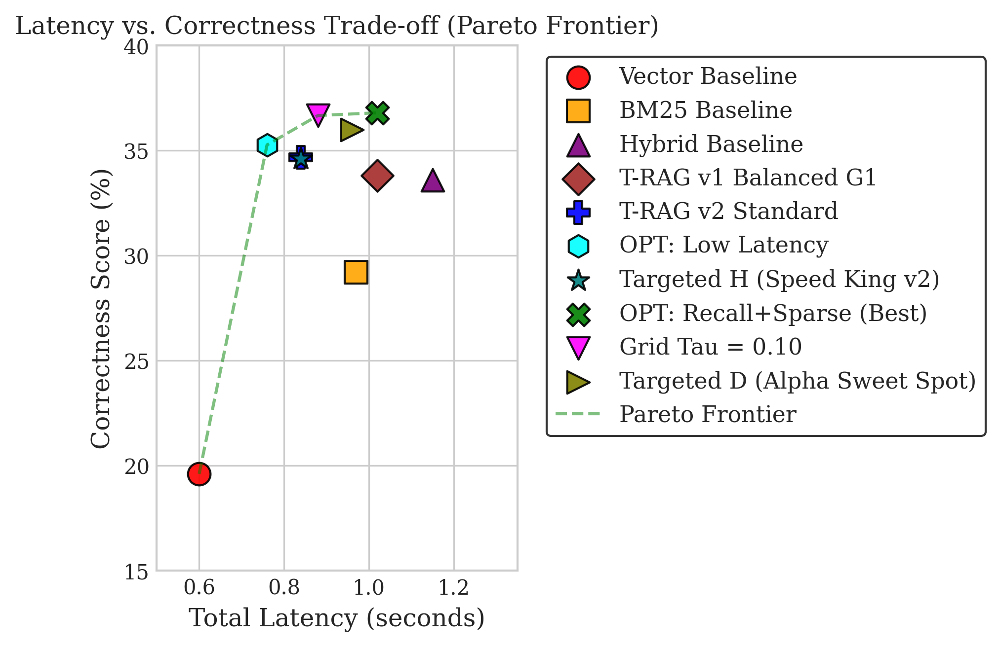
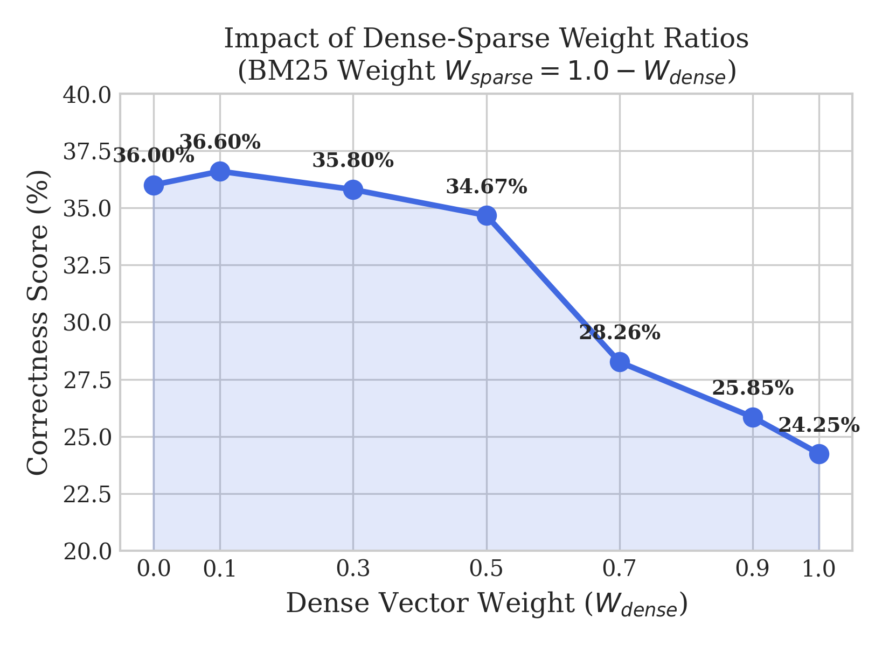
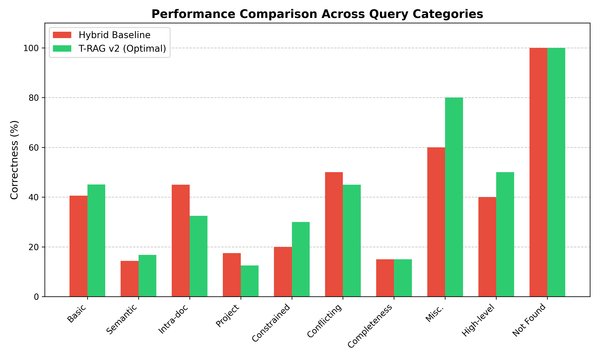
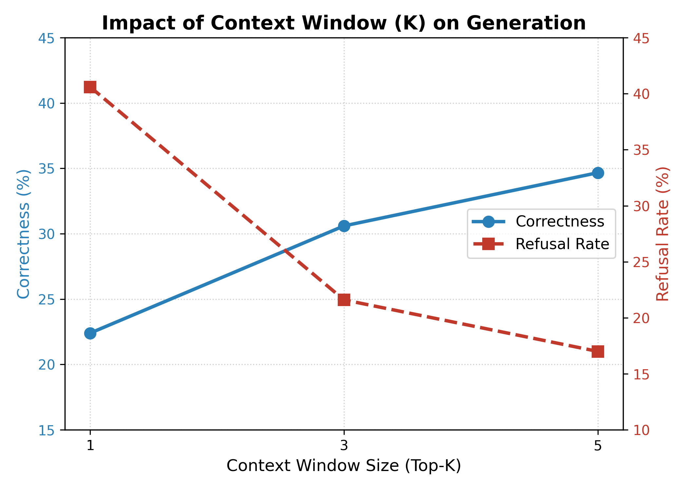

# T-RAG v2: An Adaptive and Latency-Optimized Selective Table Retrieval-Augmented Generation System for Multi-Source Enterprise Databases

Official implementation of **T-RAG v2**, an enterprise-grade Selective Table Retrieval-Augmented Generation framework optimized for sharded multi-source knowledge bases (Jira, Confluence, Slack, GitHub, Linear, etc.).

---

## Overview

Retrieval-Augmented Generation (RAG) is the standard architecture for grounding Large Language Models (LLMs) on enterprise domain data. However, corporate knowledge bases are fragmented across multiple communication channels and workflow management systems. Executing naive global vector searches across a monolithic database introduces substantial computational latency and embedding noise.

Selective Table RAG (T-RAG) partitions enterprise data into domain-specific database tables (shards) and routes queries to relevant shards before retrieval. **T-RAG v2** resolves critical latency bottlenecks present in multi-hop selective retrieval (such as double-encoding overhead and rigid static routing thresholds) through an **Entropy-driven Adaptive Thresholding** mechanism, **Source-Weighted Reciprocal Rank Fusion (SW-RRF)**, and a **Smart Hop 2** conditional execution pipeline.

Evaluated on the 500-question **EnterpriseRAG-Bench** dataset, T-RAG v2 achieves:
- **36.80% Correctness**: An absolute gain of +17.20% over standard dense vector search.
- **6x Retrieval Speedup**: Reduces retrieval latency from ~1.60s to 0.26s.
- **34% End-to-End Latency Reduction**: Bypasses redundant multi-hop entity extraction loops while preserving cross-source reasoning capabilities.

---

## System Architecture


The T-RAG v2 pipeline operates across five structured execution phases:

1. **Probabilistic Source Router (PSR)**: Encodes incoming user queries $Q$ into 1024-dimensional embeddings via `BAAI/bge-large-en-v1.5` and predicts relevance probabilities $P(\text{Source}_i | Q)$ across $K=9$ sharded tables using a multi-label sigmoid classifier.
2. **Entropy-Driven Adaptive Tau Thresholding**: Computes the normalized Shannon Entropy of router predictions to assess query ambiguity. The routing threshold $\tau_{eff}$ dynamically scales between $[0.05, 0.40]$, automatically broadening search space for ambiguous inquiries and tightening boundaries for precise queries.
3. **Local Hybrid Search**: For each active shard ($P(\text{Source}_i | Q) \ge \tau_{eff}$), parallel local retrievals are executed: Dense Search via LanceDB vector index and Sparse Search via a Tantivy full-text engine for exact keyword matching.
4. **Source-Weighted Reciprocal Rank Fusion (SW-RRF)**: Fuses candidate lists across active shards while weighting document scores by predicted shard probabilities to suppress noise from low-confidence sources.
5. **Smart Hop 2 & Conditional CSEP**: Evaluates single-source constraints and first-hop evidence confidence ($d_{top1} < 0.55$). Bypasses second-hop entity extraction when first-hop context is sufficient, eliminating double-encoding overhead.
6. **Reranking & LLM Generation**: Reranks top merged candidate chunks via a Cross-Encoder and generates grounded answers using LLMs (Qwen2.5-14B-Instruct / Mistral-7B-Instruct) accelerated by vLLM.

---

## Mathematical Formulation

### 1. Probabilistic Source Router (PSR)
Query $Q$ is mapped to embedding $\phi(Q)$. The predicted probability for shard $i$ is:
$$\bar{p}_i = P(\text{Source}_i | Q) = \sigma(W_i \cdot \phi(Q) + b_i)$$

### 2. Adaptive Tau Thresholding
Normalized source probability distribution $\bar{p}_i = \frac{p_i}{\sum_{j=1}^K p_j}$. The Shannon Entropy $H$ is:
$$H = - \sum_{i=1}^K \bar{p}_i \ln(\bar{p}_i)$$

The routing confidence score is:
$$\text{Confidence} = 1 - \frac{H}{\ln(K)}$$
where $H_{max} = \ln(9) \approx 2.197$. The effective threshold $\tau_{eff}$ is computed as:
$$\tau_{eff} = \tau_{base} + \alpha \times (\text{Confidence} - 0.5)$$
bounded strictly within $\tau_{eff} \in [0.05, 0.40]$.

### 3. Source-Weighted Reciprocal Rank Fusion (SW-RRF)
$$\text{Score}_{\text{SW-RRF}}(d) = P(\text{Source}_d | Q)^{\gamma} \times \left( \frac{W_{dense}}{k + Rank_{D}(d)} + \frac{W_{sparse}}{k + Rank_{S}(d)} \right)$$
where $Rank_D(d)$ and $Rank_S(d)$ are document ranks in dense and sparse candidate lists, $k=60$ is the RRF constant, and $\gamma$ is the diversity penalty coefficient.

---

## Experimental Evaluation & Benchmark Results

### 1. Baseline Pipeline Comparisons
Comparative performance on the 500-question EnterpriseRAG-Bench dataset:

| Configuration | Correctness (%) | Completeness (%) | Refusal Rate (%) | Total Latency (s) |
| :--- | :---: | :---: | :---: | :---: |
| Vector Baseline | 19.60 | 30.24 | 32.0% | 0.60s |
| Vector + Reranker | 24.65 | 33.84 | 26.8% | 0.69s |
| BM25 Baseline | 29.20 | 39.50 | 23.0% | 0.97s |
| Hybrid Baseline | 33.60 | 44.11 | 18.0% | 1.15s |
| LLM Router Baseline | 27.80 | 38.57 | 21.8% | 0.88s |
| Query Expansion | 32.60 | 43.14 | 19.8% | 2.46s |

---

### 2. Latency vs. Accuracy Pareto Frontier



T-RAG v2 establishes a superior Pareto frontier compared to conventional baseline pipelines. By selectively querying database shards, T-RAG v2 reduces retrieval latency from 0.63s (Hybrid Baseline) down to 0.27s while pushing correctness to **36.80%**.

---

### 3. Dense vs. Sparse Search Weight Interplay



| $W_{dense}$ | $W_{sparse}$ | Correctness (%) | Completeness (%) | Total Latency (s) |
| :---: | :---: | :---: | :---: | :---: |
| $D=1.0$ (Dense-only) | $S=0.0$ | 24.25% | 34.66% | 0.82s |
| $D=0.9$ | $S=0.1$ | 25.85% | 34.83% | 0.82s |
| $D=0.7$ | $S=0.3$ | 28.26% | 37.18% | 0.82s |
| $D=0.5$ (Balanced) | $S=0.5$ | 34.67% | 44.91% | 0.84s |
| $D=0.3$ | $S=0.7$ | 35.80% | 45.61% | 0.92s |
| $D=0.1$ | $S=0.9$ | **36.60%** | 45.60% | 1.21s |
| $D=0.0$ (Sparse-only) | $S=1.0$ | 36.00% | **46.60%** | 1.26s |

---

### 4. Routing Sensitivity Analyses

#### Base Threshold ($\tau_{base}$) Sensitivity
| Threshold ($\tau_{base}$) | Correctness (%) | Completeness (%) | Search Space (Docs) | Total Latency (s) |
| :--- | :---: | :---: | :---: | :---: |
| $\tau_{base}=0.05$ | 36.07% | 44.97% | 3,573,824 | 0.90s |
| $\tau_{base}=0.10$ | **36.67%** | 44.99% | 3,323,143 | 0.88s |
| $\tau_{base}=0.15$ (Standard) | 34.67% | 44.91% | 2,711,818 | 0.84s |
| $\tau_{base}=0.20$ | 35.47% | 44.50% | 2,219,777 | 0.80s |
| $\tau_{base}=0.30$ | 35.30% | **45.90%** | 1,456,839 | 0.91s |

#### Dynamic Scaling ($\alpha$) Sensitivity
| Adaptive Coefficient ($\alpha$) | Correctness (%) | Completeness (%) | Search Space (Docs) | Total Latency (s) |
| :--- | :---: | :---: | :---: | :---: |
| $\alpha=0.00$ (Disabled) | 35.67% | 44.19% | 2,393,189 | 0.82s |
| $\alpha=0.04$ | 35.60% | 45.84% | 2,540,258 | 0.91s |
| $\alpha=0.08$ (Standard) | 34.67% | 44.91% | 2,711,818 | 0.84s |
| $\alpha=0.12$ | 35.70% | **46.80%** | 2,853,707 | 1.00s |
| $\alpha=0.15$ | 36.27% | 45.47% | 3,006,387 | 0.86s |
| $\alpha=0.25$ | **36.70%** | 46.70% | 3,416,644 | 1.05s |
| $\alpha=0.50$ (Aggressive) | 36.07% | 44.99% | 3,573,824 | 0.90s |

#### Diversity Penalty ($\gamma$) Sensitivity
| Penalty Coefficient ($\gamma$) | Correctness (%) | Completeness (%) | Refusal Rate (%) | Total Latency (s) |
| :--- | :---: | :---: | :---: | :---: |
| $\gamma=0.0$ (Disabled) | **36.40%** | 45.52% | 17.0% | 0.84s |
| $\gamma=0.3$ | 35.70% | 45.70% | 15.4% | 0.99s |
| $\gamma=0.5$ (Standard) | 34.67% | 44.91% | 17.0% | 0.84s |
| $\gamma=0.7$ | 34.50% | **45.80%** | 15.6% | 0.99s |
| $\gamma=1.0$ | 33.30% | 44.80% | 16.0% | 1.00s |

---

### 5. Ablation Study

| Configuration | Correctness (%) | Completeness (%) | Retrieval Latency (s) | Total Latency (s) |
| :--- | :---: | :---: | :---: | :---: |
| **T-RAG v2 Standard** | **34.67%** | **44.91%** | **0.27s** | **0.84s** |
| Ablation: No CSEP (Hop 2 Skipped) | 34.67% | 44.38% | 0.25s | 0.82s |
| Ablation: Unconditional Hop 2 | 32.80% | 43.93% | 0.58s | 1.16s |

---

### 6. Granular Query Category Breakdown



T-RAG v2 outperforms standard Hybrid pipelines across factual and constrained inquiries (*Basic* +4.5%, *Constrained* +10.0%, *Miscellaneous* +8.5%) by containing vector search within high-confidence shards.

---

### 7. Context Window & Retrieval Depth Dynamics



Restricting LLM context to $K=1$ document causes severe information starvation (40.6% refusal rate). Expanding the context window to $K=5$ drops refusal rates to 17.0% while optimizing end-to-end correctness.

---

## Environment Setup & Installation

### Prerequisites
- Linux OS (Ubuntu 20.04/22.04 recommended)
- Python 3.10+
- CUDA 12.0+ compatible GPU (for vLLM inference and Cross-Encoder reranking)

### 1. Repository Setup
```bash
git clone https://github.com/your-username/T-RAG.git
cd T-RAG
```

### 2. Virtual Environment Configuration
```bash
conda create -n trag python=3.10 -y
conda activate trag
pip install -r requirements.txt
```

### 3. Environment Variables (.env)
Create a `.env` file in the root directory:
```ini
RAG_DB_URI="data/lancedb"
LOCAL_LLM_MODEL="Qwen/Qwen2.5-14B-Instruct"
JUDGE_LLM_MODEL="Qwen/Qwen2.5-14B-Instruct"
EMBEDDING_MODEL="BAAI/bge-large-en-v1.5"
PSR_MODEL_DIR="models/psr_v2"
VLLM_GPU_MEMORY_UTILIZATION=0.80
```

---

## Quickstart & Execution Workflows

### 1. Smoke Testing (2-Question Sanity Check)
Verify pipeline components, vector index connections, and PSR routing:
```bash
bash test_smoke_v6.2.sh
```

### 2. Running Full Benchmark Suite (53 Configurations)
Run the comprehensive benchmark evaluation across 500 questions:
```bash
bash run_all_v6.2.sh --limit 500
```

### 3. Running Targeted Model Benchmark
Execute cherry-picked optimal configurations:
```bash
bash run_targeted_v6.sh --limit 500
```

### 4. Generating Comparative Evaluation Reports
Aggregate benchmark results into structured comparative markdown tables:
```bash
python generate_report.py results_v6.2
```

---

## Repository Structure

```
.
├── data/                       # Sharded EnterpriseRAG-Bench dataset & LanceDB indices
├── models/                     # Trained PSR Router weights (psr_v2)
├── paper_temp/                 # IEEE Conference LaTeX source, figures, and publication PDF
│   └── IEEE-conference-template-062824/
│       ├── fig1.png            # T-RAG v2 Architecture Diagram
│       ├── fig_pareto.png      # Latency-Accuracy Pareto Curve
│       ├── fig_dense_sparse.png# Dense vs Sparse Weight Curve
│       ├── fig_query_types.png # Query Category Breakdown
│       └── fig_context_k.png   # Context Window Dynamics
├── results_v6.2/               # Benchmark execution output logs & evaluations
├── src/                        # Core Python source directory
│   ├── baselines/              # Baseline implementations (BM25, Vector, Hybrid, HyDE, LLM Router)
│   ├── generation/             # vLLM offline batch generator
│   ├── models/                 # PSR Router inference (`router_inference.py`)
│   ├── reranker/               # Cross-Encoder Reranker
│   ├── retrieval/              # Hybrid retrieval & Tantivy full-text search engine
│   ├── scripts/                # Metrics-based evaluation script (`metrics_based_eval.py`)
│   └── trag_v2/                # Core T-RAG v2 engine (`retriever_v2.py`, `csep_retriever_v2.py`)
├── generate_report.py          # Unified benchmark evaluation report generator
├── run_all_v6.2.sh             # Main benchmark automation shell script (53 configs)
├── run_targeted_v6.sh          # Targeted configuration benchmark script
└── test_smoke_v6.2.sh          # Pipeline verification smoke test script
```

---

## Citation

If you use T-RAG v2 or EnterpriseRAG-Bench in your research, please cite our IEEE paper:

```bibtex
@inproceedings{nguyen2026tragv2,
  title={T-RAG: An Adaptive and Latency-Optimized Selective Table Retrieval-Augmented Generation System for Multi-Source Enterprise Databases},
  author={Nguyen, Bang Dinh and Tran, Bao Dang and Nguyen, Minh Quoc},
  booktitle={IEEE International Conference on Artificial Intelligence and Knowledge Engineering},
  year={2026},
  organization={Faculty of Computer Science and Engineering, Ho Chi Minh City University of Technology (HCMUT-VNU HCM)}
}
```

---

## License

This project is licensed under the MIT License - see the [LICENSE](LICENSE) file for details.
